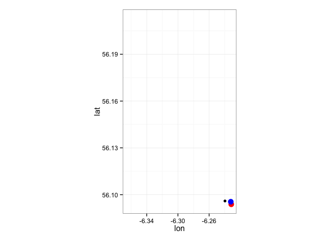
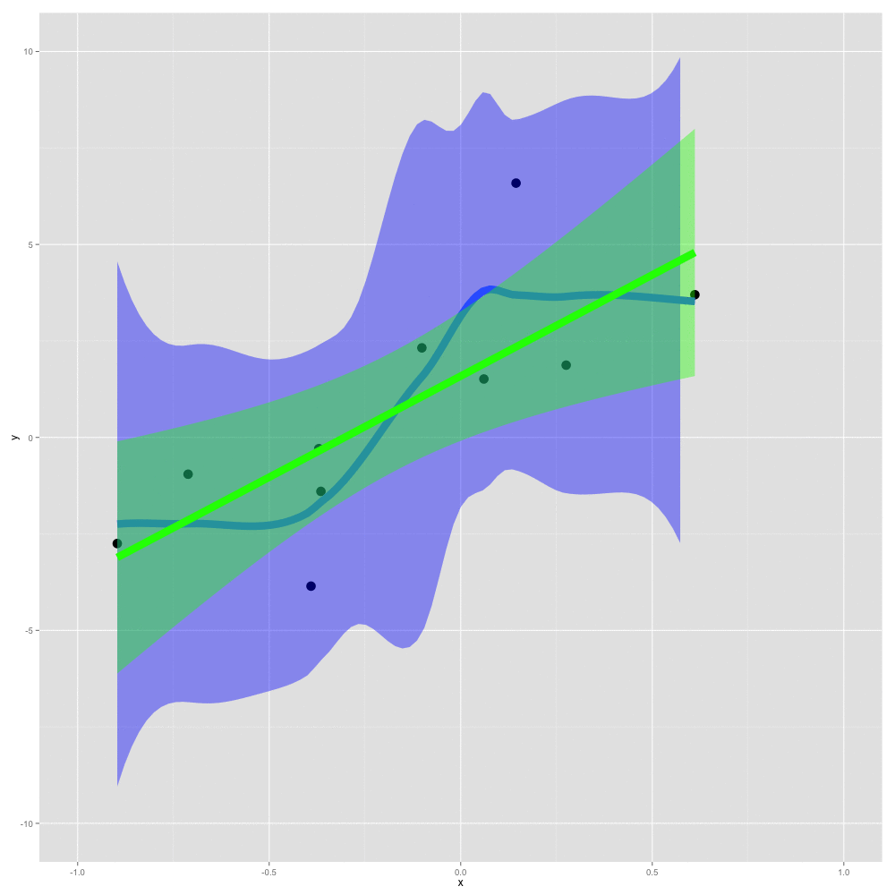

# Creating animations in R
Robin Freeman, IoZ  
20 August 2015  


## Creating animations in R

Often datasets can be hard to visualise in static two-dimensional graphs (and this is particulartly true of spatio-temporal data such as tracking data).

As an example, the following is a plot of the movements of a seabird off the coast of the UK (Colonsay) (data is available <a href="bird_data.csv">here</a>):


```r
# Read example tracking data
bird_data <- read.csv("bird_data.csv")
plot(bird_data$lon, bird_data$lat)
```

 

We could make this a little prettier using ggplot, perhaps showing the calculated speed at each point, and fixing the aspect ratio:


```r
library(ggplot2)
ggplot(bird_data, aes(x=lon, y=lat, color=sp.ms)) + geom_point() + coord_fixed(ratio = 2/1) + theme_bw()
```

 

We could even add markers at the start and end to try and give some indicator of directionality, but the result still makes it hard to understand the dynamics or temporal aspect of the data:


```r
ggplot(bird_data, aes(x=lon, y=lat, color=sp.ms)) + 
  geom_point() +
  geom_point(data=head(bird_data, 1), color="red", size=4) + 
  geom_point(data=tail(bird_data, 1), color="blue", size=4) + coord_fixed(ratio = 2/1) + theme_bw()
```

 

The key to producing animations in R is to be able to break down your plot into the elements you wish to plot on each frame. Essentially creating individual images for each frame which will then be combined back together into an animated GIF or movie.

So, in the example here, we might want to plot each point on a single frame, perhaps as simple as plotting a single row (here the 10th row). However, as we don't want our axis to jump around with the plotted data we add xlim() and ylim() to the mix (we want them to remain the same as if we were plotting all the data):


```r
# Same plot with only the 10th row
ggplot(data = bird_data[10, ], aes(x=lon, y=lat)) + 
  geom_point() + 
  # But also fixing the limits do they don't collapse to our point
  xlim(min(bird_data$lon), max(bird_data$lon)) +
  ylim(min(bird_data$lat), max(bird_data$lat)) + 
  geom_point(data=head(bird_data, 1), color="red", size=4) + 
  geom_point(data=tail(bird_data, 1), color="blue", size=4) + 
  coord_fixed(ratio = 2/1) + 
  theme_bw()
```

 

You could then iterate/loop over these data to create lots of plots (here 5 plots jumping 100 rows through the data each frame). It may also be nice to see the whole track at the same time, so we could plot that in a light colour in the background....


```r
for (i in seq(10, 500, by=100)) {
  g <- ggplot(bird_data[i, ], aes(x=lon, y=lat)) + 
  # Plot all data in lightgrey in background
  geom_point(data = bird_data, shape=21, fill="lightgrey", color="grey", size=3, alpha=0.2) +
  geom_point(size = 10) + 
    xlim(min(bird_data$lon), max(bird_data$lon)) +
  ylim(min(bird_data$lat), max(bird_data$lat)) + 
  geom_point(data=head(bird_data, 1), color="red", size=4) + 
  geom_point(data=tail(bird_data, 1), color="blue", size=4) + 
  coord_fixed(ratio = 2/1) + 
  theme_bw()
  print(g)
}
```

     

Now, one of the most popular options for creating animations is the `animation` package. My suggestion is that the easiest way to start is by using the ```saveHTML``` function  - this creates a webpage in the current working directory including an animation of your images:


```r
# Load the animation library
library(animation)

# saveHTML will create an image for each frame of the movie and then crete a webpage with an little interface to visualise these images as an animation. By default the images will be stored in the current directory in the folder 'images' as Rplot1.png, Rplot2.png, etc.
saveHTML({
for (i in seq(10, 500, by=100)) {
  g <- ggplot(bird_data[i, ], aes(x=lon, y=lat)) + 
  # Plot all data in lightgrey in background
  geom_point(data = bird_data, shape=21, fill="lightgrey", color="grey", size=3, alpha=0.2) +
  geom_point(size = 10) + 
  xlim(min(bird_data$lon), max(bird_data$lon)) +
  ylim(min(bird_data$lat), max(bird_data$lat)) + 
  geom_point(data=head(bird_data, 1), color="red", size=4) + 
  geom_point(data=tail(bird_data, 1), color="blue", size=4) + 
  coord_fixed(ratio = 2/1) + 
  theme_bw()
  print(g)
}
},ani.width = 600, ani.height=600, img.name = "animation1", imgdir = "animation1", htmlfile = "animation1.html")
```

```
## HTML file created at: animation1.html
```

<a href="animation1.html" target="_blank">Result here</a> 

```saveGIF``` is commonly suggested as a way to create movies, here we take the 5 frames we created above and the ```animation``` package uses ```ImageMagick``` (the ```convert``` program you might see below) to assemble these as an animated GIF. ImageMagick is free and can be installed for OSX or windows:

- OSX: http://cactuslab.com/imagemagick/

So, creating a GIF of our animation...


```r
saveGIF({
  for (i in seq(10, 500, by=100)) {
    g <- ggplot(bird_data[i, ], aes(x=lon, y=lat)) + 
    # Plot all data in lightgrey in background
    geom_point(data = bird_data, shape=21, fill="lightgrey", color="grey", size=3, alpha=0.2) +
    geom_point(size = 10) + 
    xlim(min(bird_data$lon), max(bird_data$lon)) +
    ylim(min(bird_data$lat), max(bird_data$lat)) + 
    geom_point(data=head(bird_data, 1), color="red", size=4) + 
    geom_point(data=tail(bird_data, 1), color="blue", size=4) + 
    coord_fixed(ratio = 2/1) + 
    theme_bw()
    print(g)
  }
}, ani.width = 600, ani.height=600, img.name = "animation2_gif", imgdir = "animation2_gif", movie.name = "animation2.gif", interval = 1)
```

```
## Executing: 
## 'convert' -loop 0 -delay 100 animation2_gif1.png
##     animation2_gif2.png animation2_gif3.png animation2_gif4.png
##     animation2_gif5.png 'animation2.gif'
## Output at: animation2.gif
```

```
## [1] TRUE
```


For another example, we might look at the impact of N on modelling some simple noisy data:


```r
saveGIF({
  x_all = runif(-1, 1, n=100)
  y_all = x_all*2.1 + rnorm(100, 0)*3
  
  for (N in seq(from=10, to=100, by=10)) {
    x = x_all[1:N] 
    y = y_all[1:N] 
    g <- ggplot(data=data.frame(x, y), aes(x, y)) + 
      geom_point(size=5) + stat_smooth(method = "loess", size=4, fill="blue") +
      stat_smooth(method = "lm", size=4, color="green", fill="green") +
      xlim(-1, 1) + ylim(-10, 10)
    print(g)
  }
}, ani.width = 600, ani.height = 600, img.name = "lm_model_n", imgdir = "lm_model_n", movie.name = "lm_model_n.gif", interval = 1, overwrite = TRUE)
```


However I find that creating animated GIFs is only really suitable for animations of a few frames, perhaps to compare a few options/graphs visually. For animations involving hundereds or thousands of frames, creating a video file using ```saveVideo``` may be a better option. 

- The ```animation``` package also has a ```saveMovie``` option which acts in the same way to ```saveGIF``` so be careful to with the distinction between ```saveVideo``` (makes a video file) and ```saveMovie``` (makes a GIF)

Before, we create a video, let's make sure we have our animation looking the way we really want. First, we could plot each point individually (I've limited this to the first 100 frames):


```r
# Load the animation library
library(animation)

# saveHTML will create an image for each frame of the movie and then crete a webpage with an little interface to visualise these images as an animation. By default the images will be stored in the current directory in the folder 'images' as Rplot1.png, Rplot2.png, etc.
# This took 7.5 minutes on my macbook for approx 1500 images at 1000x1000 pixels
saveHTML({
  #for (i in 1:nrow(bird_data)) {
  for (i in 1:100) {
    g <- ggplot(bird_data[i, ], aes(x=lon, y=lat)) + 
    geom_point() + 
    xlim(min(bird_data$lon), max(bird_data$lon)) +
    ylim(min(bird_data$lat), max(bird_data$lat))
    print(g)
  }
},ani.width = 600, ani.height=600, img.name = "animation2", imgdir = "animation2", htmlfile = "animation2.html")
```
<a href="animation2.html" target="_blank">Result here</a> 

Here, we've adapted the plot to show a small 'window' of data to get an idea of the dynamics around the current point


```r
# Same as before, but this time showing a small 'window' of 20 points
# This took 7.5 minutes on my macbook for approx 1500 images at 1000x1000 pixels
saveHTML({
  #for (i in 10:(nrow(bird_data)-10)) {
  for (i in 10:110) {
    g <- ggplot(bird_data[(i-10):(i+10), ], aes(x=lon, y=lat)) + 
    geom_point() + 
    xlim(min(bird_data$lon), max(bird_data$lon)) +
    ylim(min(bird_data$lat), max(bird_data$lat))
    print(g)
  }
}, ani.width = 600, ani.height=600, img.name = "windowed_data", interval=0.1, imgdir = "windowed_data", htmlfile = "index_window.html")
```
<a href="index_window.html" target="_blank">Result here</a> 

And we could also get some coastline data (from OpenStreetMap) and add time to the title of the plot:


```r
# Let's use the open street map library to get some coast information from OSM
#install.packages("osmar")
library(osmar)

# Setup the API 
src <- osmsource_api()
# Get a bounding box around Colonsay
bb <- center_bbox(-6.2686, 56.0709,20000,20000)  #you have to define a bounding box for the area of interest
# Get the OSM data for that box
colonsay <- get_osm(bb, source = src) # and download them

# Extract natural features from data
nat_ids <- find(colonsay, way(tags(k == "natural")))
nat_ids <- find_down(colonsay, way(nat_ids))
nat <- subset(colonsay, ids = nat_ids)

# Turn data into polylines
b_poly <- as_sp(nat, what="lines")
# Fortify to make data frame
coast <- fortify(b_poly)

# Save data for later
write.csv(coast, "colonsay_coast.csv")
```

Let's plot the coastline to check it looks ok:


```r
# Read in saved data
coast <- read.csv("colonsay_coast.csv")
# Check data by plotting as path (ordered line)
ggplot(coast, aes(x = long, y = lat,group=group)) + geom_path() + coord_fixed(ratio = 2/1)
```

 

Then bringing everything together...


```r
# Same as before, but this time showing a small 'window' of 20 points
# This took 7.5 minutes on my macbook for approx 1500 images at 1000x1000 pixels
saveHTML({
  #for (i in 10:(nrow(bird_data)-10)) {
  for (i in 10:500)) {
    g <- ggplot(bird_data[(i-10):(i+10), ], aes(x=lon, y=lat)) + 
    geom_point(data = bird_data, shape=21, fill="lightgrey", color="grey", size=3, alpha=0.2) +
    geom_point(size=3, color="darkgreen", alpha=0.5) + 
    geom_path(data=coast, aes(x = long, y = lat,group=group), color="lightgrey") +
    xlim(min(bird_data$lon), max(bird_data$lon) + 0.1) +
    ylim(min(bird_data$lat) - 0.1, max(bird_data$lat)) +
    ggtitle(paste("Date/Time: ", as.POSIXct(bird_data[i, ]$unix, origin = "1970-01-01"), sep="")) + coord_fixed(ratio = 2/1) + theme_bw()
    print(g)
  }
}, ani.width = 600, ani.height=600, img.name = "windowed_data_outline", imgdir = "windowed_data_outline", htmlfile = "windowed_data_outline.html")
```

<a href="windowed_data_outline.html" target="_blank">Result here</a> 

Interestingly, if we wanted to fiddle with some of the animation options, but didn't want to have to regenerate the source images, something like the following can be used. Here we're changing the interval to be about 20 frames per second. The important part is ```use.dev=FALSE``` which tells the package not to use the current plot device. There's also no code inside the inner brackets.


```r
saveHTML({
  ## Don't do anything here, we're going to use the existing images...
   
 }, use.dev = FALSE, ani.width = 600, ani.height=600, interval=0.05, img.name = "windowed_data_outline", imgdir = "windowed_data_outline", htmlfile = "windowed_data_outline_fast.html")
```

<a href="windowed_data_outline_fast.html" target="_blank">Result here</a> 

For each of these HTML examples, the ```animation``` package has created a directory full of images which it is showing us as an animation (using javascript). If, instead of using ```saveHTML``` we had used ```saveVideo``` then the package would have used ```ffmpeg``` to combine these into a vidoe file.

This is much quicker and produces something that's I've found easier to use in powerpoint, etc. However, to use this option requires that ```ffmpeg``` is installed. Instructions on how to install this are here:

- Installing on OSX: http://www.renevolution.com/how-to-install-ffmpeg-on-mac-os-x/
- Installing on Windows: http://www.wikihow.com/Install-FFmpeg-on-Windows

Then ```saveVideo``` can be used:


```r
## usually Linux/OSX users don't need to worry about the path as long as FFmpeg has
## been installed
oopts = ani.options(ffmpeg = "D:/Installer/ffmpeg/bin/ffmpeg.exe")
if (.Platform$OS.type != "windows") {
  ani.options(ffmpeg = "ffmpeg")
}
saveVideo({
    for (i in 1:nrow(bird_data)) {
      g <- ggplot(bird_data[i, ], aes(x=lon, y=lat)) + 
      geom_point() + 
      xlim(min(bird_data$lon), max(bird_data$lon)) +
      ylim(min(bird_data$lat), max(bird_data$lat))
      print(g)
    }
}, ani.width = 600, ani.height=600, video.name = "output_video.mp4", other.opts = "-b 300k")  # higher bitrate, better quality

ani.options(oopts)
```


Resulting in (*You may need to view this in a browser like Chrome or Firefox to see the video*): 

<video width="300" height="300" controls>
  <source src="output.mp4" type="video/mp4">
  <source src="output.webm" type="video/mp4">
Your browser does not support the video tag.
</video>

The ```animation``` package is using programs like ```ffmpeg``` or ```convert``` to create vidoes and GIFs respectively, we can also use these commands ourselves using the ```system``` command (or using a terminal/DOS prompt):

Some examples of just creating a video from an image sequence...

```r
# Create a MPG video called output.mpg from the image sequence in 'images' where each images are called Rplot0.png, Rplot1.png, etc
system("ffmpeg -f image2 -i windowed_data_outline/windowed_data_outline%d.png -y -b 300k  output.mpg")

# Same mpeg video, but encoded at a high bitrate (quality)
system("ffmpeg -f image2 -i windowed_data_outline/windowed_data_outline%d.png -y -b 5000k  output_5000k.mpg")

# Create a MPG video called output.webm using the vpx codec from the image sequence in 'images' where each images are called Rplot0.png, Rplot1.png, etc
system("ffmpeg -f image2 -i windowed_data_outline/windowed_data_outline%d.png -y -vcodec libvpx -acodec libvorbis output.webm")

# Create a MPG video called output.mp4 using the x264 codec from the image sequence in 'images' where each images are called Rplot0.png, Rplot1.png, etc
system("ffmpeg -f image2 -i windowed_data_outline/windowed_data_outline%d.png -y -vcodec libx264 -acodec libfaac output.mp4")

system("ffmpeg -i output.mp4 -q:a 2 -q:v 4 -vcodec wmv2 -y -acodec wmav2 output-video.avi")
```

## Other things...

There are also graphical user interfaces (GUIs) for ffmpeg if you'd rather use those, some free, some for a small fee:

- Windows: http://www.avanti.arrozcru.org/
- OSX: http://www.iffmpeg.com/
- OSX: http://www.ffmpegx.com/howtos.html

saveGIF requires ImageMagick (free) which can be installed for OSX or windows:

- OSX: http://cactuslab.com/imagemagick/
